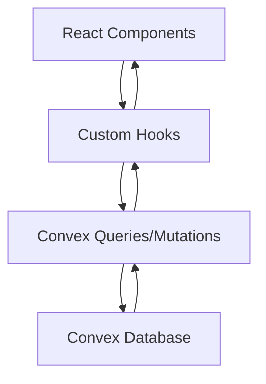

# 🚀 Contributing to FocusFlow

Welcome to FocusFlow! We're excited to have you contribute to our AI-powered daily scheduler. This guide will help you get up and running quickly and contribute effectively.

## 🎯 Table of Contents

- [Quick Start](#quick-start)
- [Project Architecture](#project-architecture)
- [Development Workflow](#development-workflow)
- [Code Style & Standards](#code-style--standards)
- [Testing](#testing)
- [Debugging](#debugging)
- [Common Tasks](#common-tasks)
- [Deployment](#deployment)
- [Getting Help](#getting-help)

## 🚀 Quick Start

### Prerequisites

- **Node.js** 18+ and npm
- **Git** for version control
- **VS Code** (recommended) with these extensions:
  - TypeScript + JavaScript
  - Tailwind CSS IntelliSense
  - ES7+ React/Redux/React-Native snippets
  - Prettier - Code formatter

### Setup

1. **Clone and Install**
   ```bash
   git clone <your-fork-url>
   cd focusflow
   npm install
   ```

2. **Set up Convex Backend**
   ```bash
   # Initialize Convex (creates .env.local automatically)
   npx convex dev --once --configure=new
   ```

3. **Start Development**
   ```bash
   # Terminal 1: Start Convex backend
   npx convex dev

   # Terminal 2: Start React app
   npm run dev
   ```

4. **Open in Browser**
   - App: [http://localhost:5173](http://localhost:5173)
   - Convex Dashboard: Check terminal output for URL

## 🏗️ Project Architecture

### Directory Structure

```
focusflow/
├── 📂 components/              # React components
│   ├── Header.tsx             # Main app header
│   ├── ScheduleList.tsx       # Schedule management UI
│   ├── TaskModal.tsx          # Task creation/editing modal
│   ├── TaskDetailsSidebar.tsx # Right sidebar with stats
│   ├── StatsPage.tsx          # Analytics dashboard
│   └── SettingsPage.tsx       # App settings
├── 📂 convex/                 # Backend (Convex functions)
│   ├── schema.ts              # Database schema
│   ├── scheduleItems.ts       # Schedule CRUD operations
│   ├── subtasks.ts            # Subtask management
│   └── completionStatus.ts    # Task completion tracking
├── 📂 hooks/                  # Custom React hooks
│   ├── useConvexSchedule.ts   # Main schedule management
│   └── useMigrationHelper.ts  # Data migration utilities
├── 📂 types/                  # TypeScript definitions
└── 📂 docs/                   # Documentation
```

### Key Technologies

- **Frontend**: React 18, TypeScript, Tailwind CSS
- **Backend**: Convex (real-time database)
- **Build Tool**: Vite
- **Authentication**: Clerk (optional)
- **AI Integration**: Gemini API (optional)

### Data Flow



## 🔄 Development Workflow

### Branch Strategy

- `main` - Production-ready code
- `develop` - Development branch
- `feature/<feature-name>` - New features
- `fix/<bug-name>` - Bug fixes
- `docs/<doc-name>` - Documentation updates

### Making Changes

1. **Create a Branch**
   ```bash
   git checkout -b feature/your-feature-name
   ```

2. **Make Changes**
   - Write code with proper TypeScript types
   - Add comments for complex logic
   - Update documentation if needed

3. **Test Your Changes**
   ```bash
   # Build check
   npm run build
   
   # Type check
   npm run type-check
   
   # Test in browser
   npm run dev
   ```

4. **Commit and Push**
   ```bash
   git add .
   git commit -m "feat: add new feature description"
   git push origin feature/your-feature-name
   ```

5. **Create Pull Request**
   - Use descriptive titles
   - Include screenshots for UI changes
   - Reference any related issues

## 📝 Code Style & Standards

### TypeScript

```typescript
// ✅ Good: Use explicit types
interface ScheduleItem {
  title: string;
  start: string;
  end: string;
  isCompleted?: boolean;
}

// ✅ Good: Use proper function documentation
/**
 * Calculates total minutes for a schedule item
 * @param start - Start time in HH:MM format
 * @param end - End time in HH:MM format
 * @returns Total minutes as number
 */
const calculateMinutes = (start: string, end: string): number => {
  // Implementation
};

// ❌ Bad: Avoid any types
const badFunction = (data: any) => {
  // This makes debugging harder
};
```

### React Components

```tsx
// ✅ Good: Use proper props interface
interface TaskModalProps {
  isOpen: boolean;
  onClose: () => void;
  onSave: (task: ScheduleItem) => void;
}

const TaskModal: React.FC<TaskModalProps> = ({ isOpen, onClose, onSave }) => {
  // Component logic
};

// ✅ Good: Use meaningful variable names
const [isLoading, setIsLoading] = useState(false);
const [selectedTask, setSelectedTask] = useState<ScheduleItem | null>(null);

// ❌ Bad: Avoid unclear names
const [data, setData] = useState();
const [flag, setFlag] = useState(false);
```

### Convex Functions

```typescript
// ✅ Good: Use proper error handling and logging
export const updateScheduleItem = mutation({
  args: {
    id: v.id("scheduleItems"),
    title: v.optional(v.string()),
    // ... other args
  },
  handler: async (ctx, args) => {
    console.log('🔄 Updating schedule item:', args.id);
    try {
      const result = await ctx.db.patch(args.id, args);
      console.log('✅ Schedule item updated successfully');
      return result;
    } catch (error) {
      console.error('❌ Error updating schedule item:', error);
      throw error;
    }
  },
});
```

### Commenting Standards

```typescript
// ✅ Good: Explain WHY, not just WHAT
// Sort schedule by start time to ensure proper timeline display
const sortedSchedule = useMemo(() => {
  return [...schedule].sort((a, b) => {
    const [ah, am] = a.start.split(":").map(Number);
    const [bh, bm] = b.start.split(":").map(Number);
    return ah !== bh ? ah - bh : am - bm;
  });
}, [schedule]);

// ✅ Good: Document complex calculations
/**
 * Calculate completion percentage for progress indicators
 * Uses completed tasks vs total tasks, with fallback for empty schedule
 */
const completionPercentage = useMemo(() => {
  if (totalTasks === 0) return 0;
  return Math.round((completedTasks / totalTasks) * 100);
}, [completedTasks, totalTasks]);
```

## 🧪 Testing

### Manual Testing Checklist

- [ ] **Schedule Management**
  - [ ] Add new task
  - [ ] Edit existing task
  - [ ] Delete task
  - [ ] Reorder tasks (drag & drop)
  - [ ] Mark task as complete

- [ ] **Data Persistence**
  - [ ] Refresh page (data should persist)
  - [ ] Switch between dates
  - [ ] Import/export schedule

- [ ] **UI/UX**
  - [ ] Dark/light mode toggle
  - [ ] Responsive design (mobile/desktop)
  - [ ] Keyboard navigation
  - [ ] Loading states

- [ ] **Real-time Features**
  - [ ] Live timeline indicator
  - [ ] Stats update immediately
  - [ ] Multiple tabs sync

### Testing New Features

```bash
# Test build
npm run build

# Test in different browsers
# - Chrome (primary)
# - Firefox
# - Safari (if on Mac)
# - Edge

# Test responsive design
# - Mobile (375px)
# - Tablet (768px)
# - Desktop (1024px+)
```

## 🐛 Debugging

### Common Issues & Solutions

#### 1. Convex Connection Issues
```bash
# Check if Convex is running
npx convex dev --once

# Check .env.local file
cat .env.local

# Restart both services
# Terminal 1: npx convex dev
# Terminal 2: npm run dev
```

#### 2. TypeScript Errors
```bash
# Run type check
npm run type-check

# Common fixes:
# - Add proper type annotations
# - Check import paths
# - Ensure all dependencies are installed
```

#### 3. Database/State Issues
```typescript
// Add debug logging to hooks
console.log('🔄 Schedule data:', schedule);
console.log('🔄 Completion status:', completionStatus);

// Check Convex dashboard for database state
// URL provided in terminal when running npx convex dev
```

### Debugging Tools

1. **Browser Dev Tools**
   - React Developer Tools
   - Console for logs
   - Network tab for API calls

2. **Convex Dashboard**
   - View database contents
   - Monitor function calls
   - Check real-time updates

3. **VS Code Extensions**
   - Error Lens (inline errors)
   - TypeScript Importer
   - Bracket Pair Colorizer

## 📋 Common Tasks

### Adding a New Component

1. **Create Component File**
   ```typescript
   // components/NewComponent.tsx
   import React from 'react';
   
   interface NewComponentProps {
     // Define props
   }
   
   /**
    * Brief description of what this component does
    */
   export const NewComponent: React.FC<NewComponentProps> = ({ /* props */ }) => {
     // Component logic
     return (
       <div>
         {/* JSX */}
       </div>
     );
   };
   ```

2. **Add to Index (if needed)**
   ```typescript
   // components/index.ts
   export { NewComponent } from './NewComponent';
   ```

3. **Use in Parent Component**
   ```typescript
   import { NewComponent } from './components/NewComponent';
   
   // Use in JSX
   <NewComponent prop1={value1} prop2={value2} />
   ```

### Adding a New Convex Function

1. **Create Function**
   ```typescript
   // convex/newFunction.ts
   import { mutation, query } from "./_generated/server";
   import { v } from "convex/values";
   
   export const newQuery = query({
     args: { /* define args */ },
     handler: async (ctx, args) => {
       // Implementation
     },
   });
   ```

2. **Use in Hook**
   ```typescript
   // hooks/useNewFeature.ts
   import { useQuery } from "convex/react";
   import { api } from "../convex/_generated/api";
   
   export const useNewFeature = () => {
     const data = useQuery(api.newFunction.newQuery, {});
     return { data };
   };
   ```

### Adding New Environment Variables

1. **Add to .env.local**
   ```bash
   NEW_VARIABLE=your_value
   ```

2. **Add to Vite Config (if needed)**
   ```typescript
   // vite.config.ts
   export default defineConfig({
     define: {
       'process.env.NEW_VARIABLE': JSON.stringify(process.env.NEW_VARIABLE),
     },
   });
   ```

## 🚀 Deployment

### Production Checklist

- [ ] All TypeScript errors fixed
- [ ] Build completes successfully
- [ ] Environment variables configured
- [ ] Database schema deployed
- [ ] Testing completed
- [ ] Documentation updated

### Deployment Steps

1. **Build and Test**
   ```bash
   npm run build
   npm run preview  # Test production build
   ```

2. **Deploy Convex**
   ```bash
   npx convex deploy
   ```

3. **Deploy Frontend**
   ```bash
   # Follow your hosting provider's instructions
   # (Vercel, Netlify, etc.)
   ```

## 🆘 Getting Help

### Resources

- **Documentation**: Check `/docs` folder
- **GitHub Issues**: Search existing issues first
- **Convex Docs**: [https://docs.convex.dev](https://docs.convex.dev)
- **React Docs**: [https://react.dev](https://react.dev)
- **TypeScript Docs**: [https://www.typescriptlang.org](https://www.typescriptlang.org)

### Getting Support

1. **Check Common Issues** (above)
2. **Search GitHub Issues**
3. **Create New Issue** with:
   - Clear description
   - Steps to reproduce
   - Expected vs actual behavior
   - Screenshots (if UI issue)
   - Environment details

### Code Review Guidelines

When reviewing PRs:
- Check for TypeScript errors
- Verify proper error handling
- Ensure responsive design
- Test core functionality
- Review code comments/documentation

## 🎉 Thank You!

Thank you for contributing to FocusFlow! Your help makes this project better for everyone. If you have suggestions for improving this guide, please let us know!

---

**Happy coding! 🚀**
